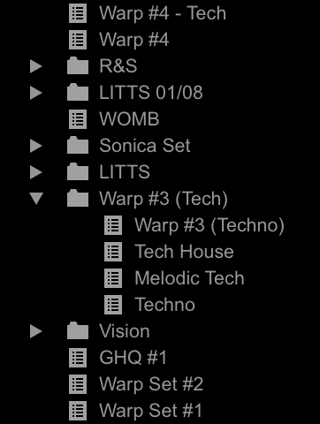
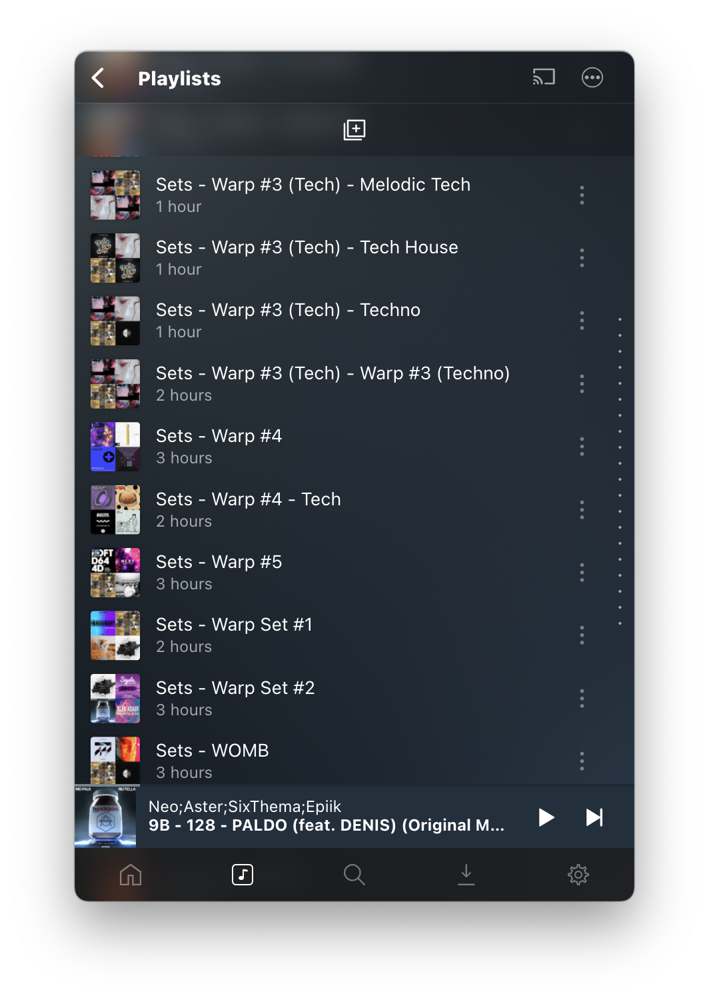

# rekordbox-plexamp-sync

CLI to sync rekordbox playlists over to plexamp

<p float="left">
  
  
</p>


## How it works
This tool will extract all playlists from the rekordbox database, then interact with the Plex Media Server API to create new playlists for each one. 

**Note:** This will only work if your rekordbox library is indexed by Plex. Make sure you deactivate all content matchers for Albums so that Plex does not match and rename tracks. This messes with the track matching to rekordbox, the titles need to be identical for better results

## Usage (mac)
Get your Plex token and server url. You can get the Plex token from localstorage when connecting to your server through the browser.

```
virtualenv venv
pip install -r requirements.txt
python app.py <server url> <token>
```

Example: `python app.py 'http://localhost:32400' '123456abcdefg'`

## Usage (windows)
I don't have a windows machine to try this on, but build the shared library with Golang.

Edit `main.go` and change the rekordbox pathes. Check the [go-rekordbox README](https://github.com/dvcrn/go-rekordbox#usage) about where to find these pathes:

```go
	optionsFilePath := filepath.Join(homeDir, "/Library/Application Support/Pioneer/rekordboxAgent/storage/", "options.json")

	// Files and paths
	asarPath := "/Applications/rekordbox 6/rekordbox.app/Contents/MacOS/rekordboxAgent.app/Contents/Resources/app.asar"
```

Then build the shared lib and generate a dll

```
go build -buildmode=c-shared -o library.dll main.go
```

Update `app.py` `get_playlists()` to load the new dll instead:

```go
library = ctypes.cdll.LoadLibrary('./library.dll')
```

Then, follow steps from "Usage (mac)"

## Limitations and todos
- Intelligent Playlists aren't supported yet, this needs some extra work
- Matching happens against filename and then title as backup, this can still be improved

## Acknowledgements
This CLI is powered by my [go-rekordbox](https://github.com/dvcrn/go-rekordbox) SDK to interact with the rekordbox DB, and [python-plexapi](https://github.com/pkkid/python-plexapi) to interact with Plex
